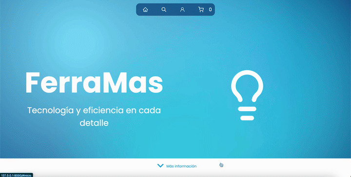
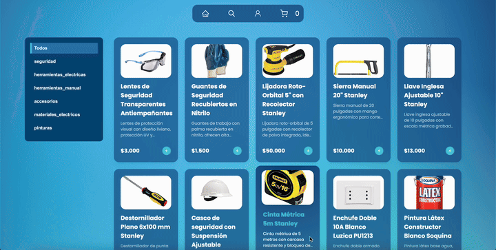
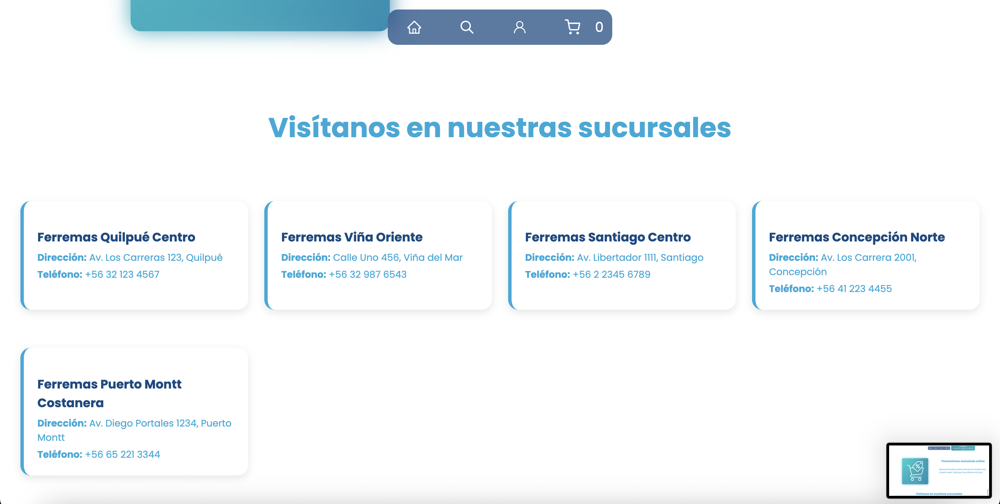
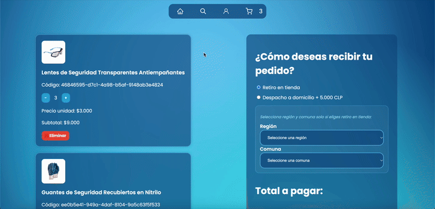
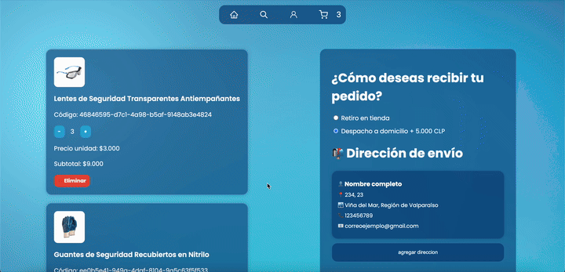
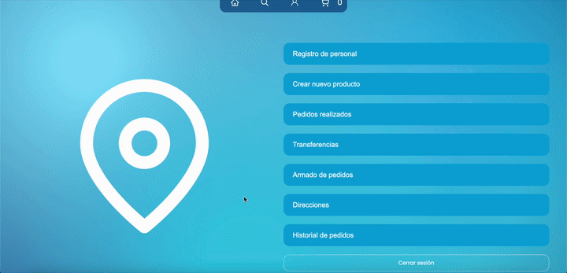
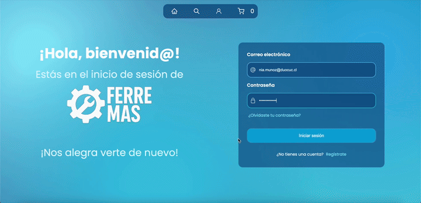
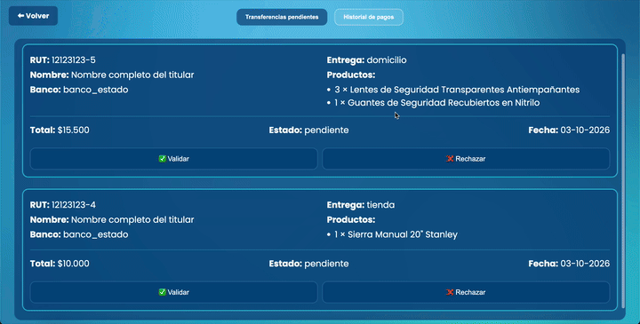
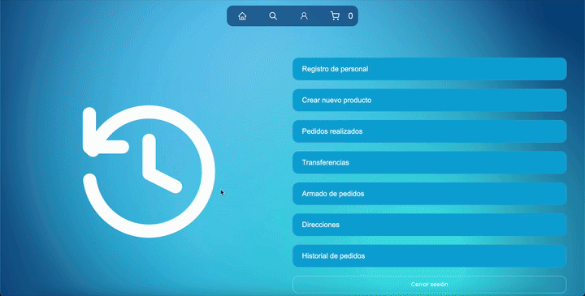

# 🛠️ FerreMas — Plataforma Web de Comercio Electrónico & Gestión Omnicanal

---

## 📖 1. Contexto del Negocio y Planteamiento del Caso

**FERREMAS** es una distribuidora tradicional de herramientas, maquinarias y materiales de construcción fundada en la década de los 80 en Santiago de Chile. En la actualidad dispone de sucursales estratégicas distribuidas entre la Región Metropolitana y regiones (Valparaíso, Biobío y Los Lagos), comercializando marcas líderes como Bosch, Makita, Stanley y Sika.

Históricamente, la compañía operó bajo un esquema de venta física directa en mostrador. La contingencia sanitaria y las restricciones de movilidad evidenciaron una necesidad crítica: modernizar la operación mediante una plataforma digital capaz de integrar la venta web con los procesos de inventario y los roles operativos de cada sucursal.

### Propósito del Proyecto
Desarrollar una solución integral de comercio electrónico que conecte la vitrina virtual y la experiencia de compra del cliente con paneles internos de gestión específicos para cada perfil de la empresa: **Administrador**, **Vendedor**, **Bodeguero** y **Contador**.

---

## 🎯 2. Matriz de Requerimientos del Sistema

| Código | Requerimiento | Descripción Funcional | Tipo |
| :--- | :--- | :--- | :--- |
| **R.1** | Cuentas Iniciales Administrador | Credenciales temporales con cambio forzado de contraseña en el primer inicio de sesión. | Funcional |
| **R.2** | Sistema de Autenticación | Control de acceso y sesiones diferenciadas por rol operativo. | Funcional |
| **R.3** | Registro y Beneficios Cliente | Registro vía correo electrónico y aplicación de promociones en compras por volumen (>4 unidades). | Funcional |
| **R.4** | Gestión de Personal Interno | Creación, asignación de sucursal y gestión de roles (Vendedor, Bodeguero, Contador). | Funcional |
| **R.5** | Catálogo Virtual | Vitrina interactiva con filtros por categoría y especificaciones técnicas detalladas. | Funcional |
| **R.6** | Carrito de Compras | Persistencia de productos seleccionados, ajuste de unidades y desglose de subtotales. | Funcional |
| **R.7** | Modalidades de Entrega | Selección entre retiro presencial en sucursales o despacho a domicilio. | Funcional |
| **R.8** | Pasarela de Pago Híbrida | Integración con Mercado Pago (tarjetas y código QR) y soporte para transferencia bancaria directa. | Funcional |
| **R.9** | Validación Comercial | Revisión y confirmación de pedidos antes de su paso a bodega. | Funcional |
| **R.10** | Control de Stock y Bodega | Identificación de productos a reponer (stock crítico ≤ 5) y preparación de órdenes. | Funcional |
| **R.11** | Conciliación Financiera | Validación de comprobantes de transferencia y registro contable de entregas. | Funcional |
| **R.12 - R.17** | Estándares de Calidad | Seguridad de datos, responsividad multidispositivo y tiempos de carga óptimos. | No Funcional |

---

## 🏛️ 3. Arquitectura y Tecnologías Utilizadas

El sistema fue desarrollado bajo el patrón arquitectónico **MVT (Model-View-Template)** utilizando el framework Django, acoplado con servicios en la nube para persistencia y pagos:

* **Backend:** Python / Django (orquestación lógica, enrutamiento, controladores y sesiones).
* **Base de Datos & Almacenamiento:** Cloud Firestore (gestión de colecciones de inventario, pedidos y usuarios en tiempo real).
* **Frontend:** HTML5 semántico, CSS3 modular, JavaScript vanilla y Lucide Icons.
* **Pasarela de Pagos:** SDK oficial de Mercado Pago (procesamiento de checkout con tarjeta y códigos QR dinámicos).
* **Georreferenciación:** Integración de APIs REST con respaldo local para la carga en cascada de regiones y comunas de Chile.

---

## 📸 4. Evidencias del Sistema y Flujos Operativos

### 4.1. Plataforma Pública y Experiencia de Usuario (Cliente)

#### Hero Banner Dinámico de Bienvenida
Cabecera interactiva a pantalla completa del sitio web con logotipo institucional, navegación rápida y carrusel continuo con la iconografía de categorías ferreteras.

<p align="center">
  
</p>

---

#### Catálogo Virtual, Ficha de Producto y Carrito
Navegación interactiva por el catálogo, apertura del modal con especificaciones técnicas normativas (ANSI Z87+), ajuste de unidades y adición dinámica al carrito con actualización de badges.

<p align="center">
  
</p>

---

#### Directorio Regional de Sucursales Físicas
Módulo con las tiendas de la red de FerreMas (Santiago Centro, Quilpué Centro, Viña Oriente, Concepción Norte y Puerto Montt Costanera) indicando dirección y contacto para retiro presencial.

<p align="center">
  
</p>

---

### 4.2. Logística de Despacho y Checkout

#### Registro y Libreta de Direcciones
Formulario de contacto y dirección con selectores en cascada por Región y Comuna, guardado dinámico de ubicación y consulta de libreta de direcciones.

<p align="center">
  
</p>

#### Modalidad Retiro en Tienda y Despacho
Alternancia fluida entre retiro físico filtrando la sucursal por región/comuna y despacho a domicilio vinculado a la dirección guardada del usuario.

<p align="center">
  
</p>

---

### 4.3. Procesamiento de Pagos (Mercado Pago & Transferencia)

#### Checkout Automatizado (Mercado Pago)
Confirmación del resumen de pedido y redirección fluida a la pasarela externa de Mercado Pago para procesar cobros seguros con tarjeta o código QR.

<p align="center">
  
</p>

#### Pago Asistido por Transferencia Bancaria
Flujo de pago manual con ingreso de datos del titular, banco emisor y registro del pedido en estado pendiente para revisión del área contable.

<p align="center">
  
</p>

---

### 4.4. Panel Administrativo y Roles Internos

#### Menú de Navegación del Perfil Administrador
Consola de control con acceso a personal, catálogo, transferencias bancarias, pedidos y armados de bodega.

<p align="center">
  
</p>

#### Registro de Personal y Asignación de Roles
Alta de nuevos trabajadores asignando roles (Vendedor, Bodeguero, Contador) y vinculación a una sucursal regional específica.

<p align="center">
  
</p>

#### Primer Acceso y Cambio Forzado de Contraseña
Directiva de seguridad que intercepta las credenciales temporales en el primer inicio de sesión para forzar la actualización de la clave personal.

<p align="center">
  
</p>

#### Validación de Pagos y Emisión de Comprobantes (Contador)
Módulo contable para revisar órdenes pendientes, validar el pago por transferencia y autorizar el despacho o retiro.

<p align="center">
  
</p>

#### Control de Inventario y Stock Crítico (Bodega)
Clasificación automática de artículos entre productos con stock regular y productos críticos a reponer (stock ≤ 5), con filtros por categoría.

<p align="center">
  
</p>

---

## ⚙️ 5. Instalación y Puesta en Marcha Local

### Prerrequisitos
* Python 3.10 o superior
* Git instalado

### Pasos de Despliegue

1. **Clonar el repositorio:**
   ```bash
   git clone [https://github.com/deralexsander/web_FerreMas.git](https://github.com/deralexsander/web_FerreMas.git)
   cd web_FerreMas/web_FerreMas