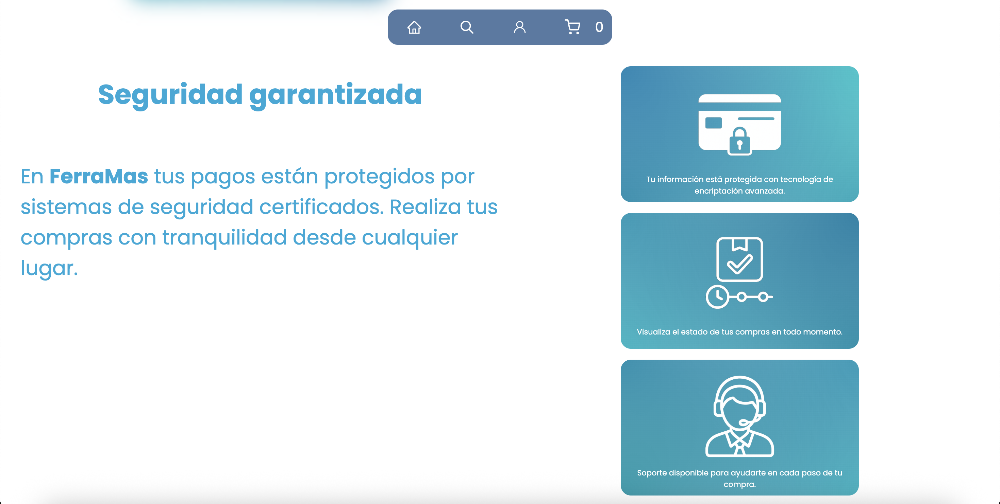
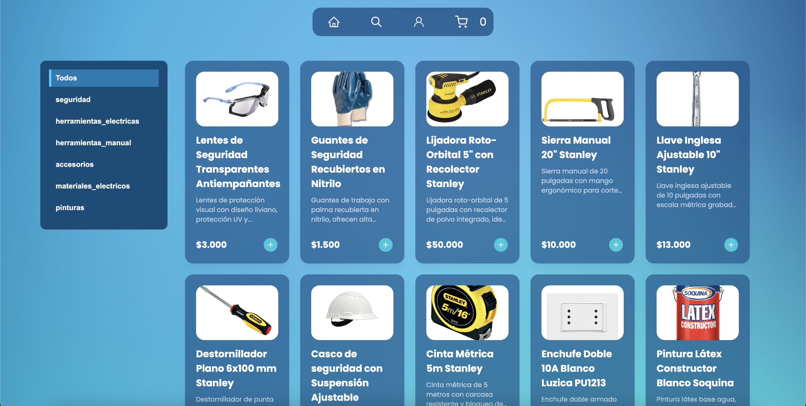

# 🛠️ FerreMas — Plataforma Web de Comercio Electrónico & Gestión Omnicanal

---

## 📖 1. Contexto del Negocio y Planteamiento del Caso

**FERREMAS** es una distribuidora tradicional de herramientas, maquinarias y materiales de construcción fundada en la década de los 80 en Santiago de Chile. En la actualidad dispone de sucursales estratégicas distribuidas entre la Región Metropolitana y regiones (Valparaíso, Biobío y Los Lagos), comercializando marcas líderes como Bosch, Makita, Stanley y Sika.

Históricamente, la compañía operó bajo un esquema de venta física directa en mostrador. La contingencia sanitaria y las restricciones de movilidad evidenciaron una necesidad crítica: modernizar la operación mediante una plataforma digital capaz de integrar la venta web con los procesos de inventario y los roles operativos de cada sucursal.

### Propósito del Proyecto
Desarrollar una solución integral de comercio electrónico que conecte la vitrina virtual y la experiencia de compra del cliente con paneles internos de gestión específicos para cada perfil de la empresa: **Administrador**, **Vendedor**, **Bodeguero** y **Contador**.

---

## 🎯 2. Matriz de Requerimientos del Sistema

| Código | Requerimiento | Descripción Funcional | Tipo |
| :--- | :--- | :--- | :--- |
| **R.1** | Cuentas Iniciales Administrador | Credenciales temporales con cambio forzado de contraseña en el primer inicio de sesión. | Funcional |
| **R.2** | Sistema de Autenticación | Control de acceso y sesiones diferenciadas por rol operativo. | Funcional |
| **R.3** | Registro y Beneficios Cliente | Registro vía correo electrónico y aplicación de promociones en compras por volumen (>4 unidades). | Funcional |
| **R.4** | Gestión de Personal Interno | Creación, asignación de sucursal y gestión de roles (Vendedor, Bodeguero, Contador). | Funcional |
| **R.5** | Catálogo Virtual | Vitrina interactiva con filtros por categoría y especificaciones técnicas detalladas. | Funcional |
| **R.6** | Carrito de Compras | Persistencia de productos seleccionados, ajuste de unidades y desglose de subtotales. | Funcional |
| **R.7** | Modalidades de Entrega | Selección entre retiro presencial en sucursales o despacho a domicilio. | Funcional |
| **R.8** | Pasarela de Pago Híbrida | Integración con Mercado Pago (tarjetas y código QR) y soporte para transferencia bancaria directa. | Funcional |
| **R.9** | Validación Comercial | Revisión y confirmación de pedidos antes de su paso a bodega. | Funcional |
| **R.10** | Control de Stock y Bodega | Identificación de productos a reponer (stock crítico ≤ 5) y preparación de órdenes. | Funcional |
| **R.11** | Conciliación Financiera | Validación de comprobantes de transferencia y registro contable de entregas. | Funcional |
| **R.12 - R.17** | Estándares de Calidad | Seguridad de datos, responsividad multidispositivo y tiempos de carga óptimos. | No Funcional |

---

## 🏛️ 3. Arquitectura y Tecnologías Utilizadas

El sistema fue desarrollado bajo el patrón arquitectónico **MVT (Model-View-Template)** utilizando el framework Django, acoplado con servicios en la nube para persistencia y pagos:

* **Backend:** Python / Django (orquestación lógica, enrutamiento, controladores y sesiones).
* **Base de Datos & Almacenamiento:** Cloud Firestore (gestión de colecciones de inventario, pedidos y usuarios en tiempo real).
* **Frontend:** HTML5 semántico, CSS3 modular, JavaScript vanilla y Lucide Icons.
* **Pasarela de Pagos:** SDK de Mercado Pago (procesamiento de checkout con tarjeta y códigos QR dinámicos).
* **Georreferenciación:** Integración de APIs REST con respaldo local para la carga en cascada de regiones y comunas de Chile.

---

## 📸 4. Evidencias del Sistema y Flujos Operativos

### 4.1. Plataforma Pública y Experiencia de Usuario (Cliente)

#### Vitrina Principal y Propuesta de Valor
Cabecera interactiva con carrusel dinámico de categorías y módulos informativos sobre garantías de compra y cobertura logística.

| Hero Banner Dinámico | Seguridad Garantizada |
| :---: | :---: |
|  |  |

#### Directorio de Sucursales
Módulo regional que exhibe las tiendas físicas habilitadas para retiro presencial con dirección y teléfono de contacto.


#### Catálogo Virtual, Ficha Técnica y Carrito
Navegación por categorías de productos (seguridad, herramientas, materiales eléctricos, pinturas), vista modal con especificaciones normativas y control de cantidades hacia el carrito.

| Catálogo General de Productos | Incorporación Interactiva al Carrito |
| :---: | :---: |
|  |  |

---

### 4.2. Logística de Entrega y Libreta de Direcciones

El checkout permite seleccionar entre despacho a domicilio (utilizando el registro dinámico de direcciones normalizadas) y retiro en tienda con selector territorial por región y comuna.

| Gestión de Direcciones de Envío | Selección de Retiro en Tienda |
| :---: | :---: |
|  |  |

---

### 4.3. Procesamiento de Pagos

Soporte dual de pago: pasarela automatizada mediante **Mercado Pago** y flujo de validación manual vía **Transferencia Bancaria**.

| Pasarela Mercado Pago | Formulario de Transferencia Bancaria |
| :---: | :---: |
|  |  |

---

### 4.4. Panel Administrativo y Roles Internos

#### Gestión de Personal y Seguridad de Cuentas
Módulo para el alta de trabajadores con asignación de sucursal y rol en el sistema, junto con la directiva de seguridad que exige cambio de contraseña en el primer acceso.

| Navegación Administrador | Alta de Trabajadores | Primer Acceso y Cambio de Clave |
| :---: | :---: | :---: |
|  |  |  |

#### Control de Caja e Inventario de Bodega
* **Contador:** Panel de conciliación para verificar comprobantes bancarios, emitir la orden validada y autorizar el despacho.
* **Bodega:** Control de existencias clasificado en artículos disponibles y artículos críticos a reponer (stock ≤ 5).

| Conciliación Contable de Transferencias | Gestión de Inventario y Stock Crítico |
| :---: | :---: |
|  |  |

---

## ⚙️ 5. Instalación y Puesta en Marcha Local

### Prerrequisitos
* Python 3.10 o superior
* Git instalado

### Pasos de Despliegue

1. **Clonar el repositorio:**
   ```bash
   git clone [https://github.com/deralexsander/web_FerreMas.git](https://github.com/deralexsander/web_FerreMas.git)
   cd web_FerreMas